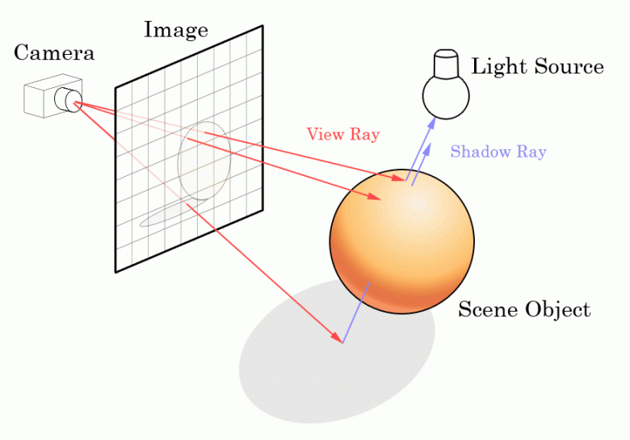
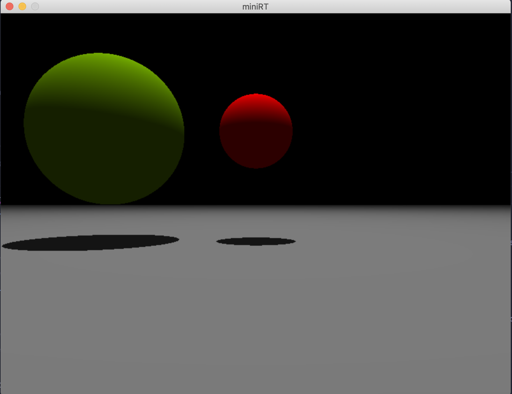

# MiniRT - Ray tracer
<div>
    
    
    
</div>

Our really first Ray Tracer!

* [Intro](#intro)
* [Usage](#usage)
* [Features](#features)
* [Scene format](#scene-format)
* [Example](#example-of-rt-file)

## Intro
____



The “Ray Tracing” method, developed for the first time in 1968 (but improved upon since) is even today more expensive in computation than the “Rasterization” method.
A ray-tracing project implemented on CPU. Allows you to generate scenes in 3D containing objects. Each scene can be be viewed by a set of cameras characterized by its position, direction and Field Of View (FOV). This project can be used only with Minilibx so it can work only on macOS.

## Usage
______

### Installation
> `git clone https://github.com/zurag/miniRT.git && cd miniRT && make`

### Starting the program
> ``./miniRT <scene_name.rt>``

<Scene_name.rt> files are located in the `srcs/scenes_files/`



## Features
______
+ **Raycasting**
+ **Object shadows**
+ **Correct intersections of the objects**
+ ~~**Multithreaded render**~~
+ ~~**Antialiasing**~~
+ ~~**Real-time camera movement / rotation**~~
+ ~~**Blinn–Phong lighting model**~~
+ ~~**Reflections of objects**~~
+ ~~**Creating screenshots**~~

## Supported figures
______
+ **Sphere**
+ **Plane**
+ **Cylinder**
+ ~~**Cone**~~
+ ~~**Hyperboloid**~~
+ ~~**Paraboloid**~~

## Scene format
____

+ Each element first's infomation is the type identifier (composed by one or two character(s)), followed by all specific information for each object in a strict order such as:


+ **Ambient lightning:**
    + `A` `0.2` `255,255,255`
    + Identifier: `A`
    + Ambient lighting ratio in range [0.0,1.0].
    + R,G,B colors in range [0-255].
      </br></br>
+ **Camera:**
    + `c` `-50,0,20` `0,0,1` `70`
    + Identifier: `C`
    + x,y,z coordinates of the view point.
    + 3d normalized orientation vector. In range [-1,1] for each x,y,z axis.
    + FOV : Horizontal field of view in degrees in range [0,180].
      </br></br>
+ **Light:**
    + `l` `-45,50,0` `0.6` `10,0,255`
    + Identifier: `L`
    + x,y,z coordinates of the light point.
    + The light brightness ratio in range [0.0,1.0].
    + R,G,B colors in range [0-255].
      </br></br>
+ **Sphere:**
    + `sp` `0,0,20.6` `12.6` `10,0,255`
    + Identifier: `sp`
    + x,y,z coordinates of the sphere center.
    + The sphere diameter.
    + R,G,B colors in range [0-255].
      </br></br>
+ **Plane:**
    + `pl` `0,0,-10` `0,0.5,0` `0,0,225`
    + Identifier: `pl`
    + x,y,z coordinates.
    + 3d normalized orientation vector. In range [-1,1] for each x,y,z axis.
    + R,G,B colors in range [0-255].
      </br></br>
+ **Cylinder:**
    + `cy` `50,0,20.6` `0,0,1` `10,0,255` `14.2` `21.42`
    + Identifier: `cy`
    + x,y,z coordinates of the cylinder center.
    + 3d normalized orientation vector. In range [-1,1] for each x,y,z axis.
    + The cylinder diameter.
    + The cylinder height.
    + R,G,B colors in range [0-255].
      </br></br>

## Example of .rt file
```c
A 0.2 255,255,255

L 0,20,0 1 255,255,255

C 0,0,5 0,0,-1  70

pl 0,-0.5,0 0,1,0 104,104,104
sp 0,1,0 1 220,0,0
sp -2,1,0 2 107,159,0
```
</div>
